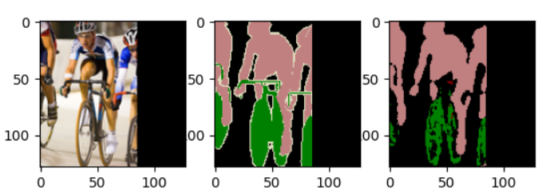
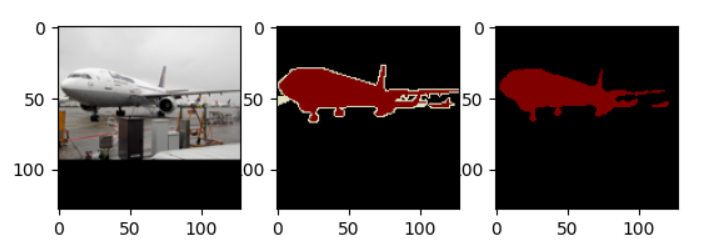
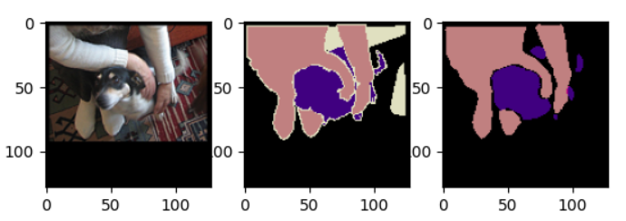
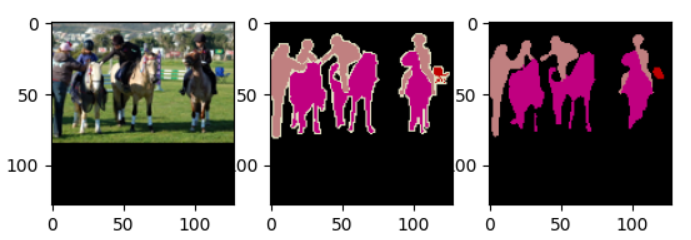

## UNet on VOC2007

> 2022.2.23 添加了一些 metrics，如：Pixel_Accuracy、Mean_Intersection_over_Union

### 数据集：VOC2007

- 一共 20 类物体 + 1 类背景
- 模型不考虑标签的边界 😎，这句代码 `segment[segment > self.num_classes] = 0` 将边界值变成了0。

### model：UNet

原论文中的 **UNet** 结构如下：

实现的不同之处 👏：

- conv3x3, ReLU 使用等宽卷积，保证了输入与输出图片的 shape 一致；
- up-conv 2x2 使用 ConvTranspose2d，没有使用 **bilinear**；
- model 的具体实现注意查看 model.py

### loss

使用的多分类交叉熵：`nn.CrossEntropyLoss()`

交叉熵损失函数可以用在大多数语义分割场景中

- 二值交叉熵损失函数

- 多分类交叉熵损失函数

  注意pytorch中多分类交叉熵损失函数的输入形式！

另外，可以尝试使用 `Dice Loss`，公式如下：

为了使 S 取值范围是[0, 1]，分子中要乘 2 。

### 训练

**优化器：**`optim.Adam`

**损失函数：**`nn.CrossEntropyLoss()`

### 效果

> 训练了200个epochs后，整体效果还可以💥

     
     
     
     

